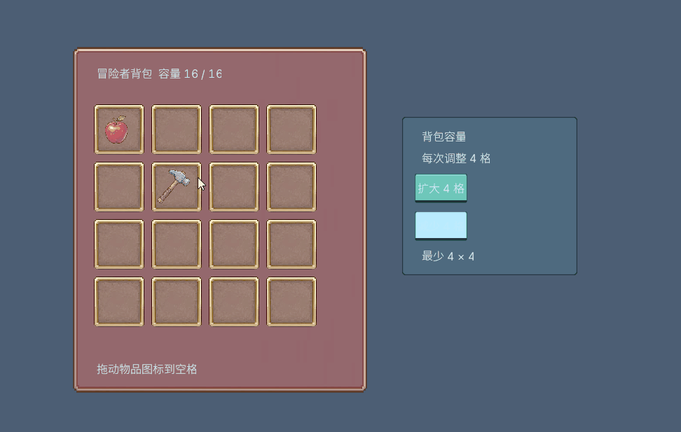

# Neon3 Example

<p align="center"></p>

<p align="center">单文件 Python 背包案例：16/20/24 格、拖拽、Tooltip、Nine Slice。</p>



## 目录

```text
python/inventory.py   # 唯一案例文件：窗口 + --probe
python/requirements.txt
node/                  # TypeScript 版本预留
assets/               # 素材、Logo、演示 GIF
```

## 启动窗口

```powershell
git clone https://github.com/unco999/Neon3-example.git
Set-Location Neon3-example
py -m venv .venv
\.venv\Scripts\python.exe -m pip install -r python\requirements.txt
\.venv\Scripts\python.exe python\inventory.py
```

如需代理，先执行：

```powershell
$env:HTTP_PROXY = "http://127.0.0.1:7892"
$env:HTTPS_PROXY = "http://127.0.0.1:7892"
```

按 `Ctrl+C` 关闭窗口。默认由 `neon3-sdk` 在线获取 Neon3 runtime；如需使用本地
checkout，按 SDK 约定设置 `NEON_ROOT` 和 `NEON_PROFILE` 即可。

## 自动验证

```powershell
\.venv\Scripts\python.exe python\inventory.py --probe --out inventory-check.png
```

成功时输出 JSONL，包含资源上传、Flow 提交、frame sequence、producer/consumer
状态和最终 `pass_result`。

## 相关项目

- [Neon3 Runtime](https://github.com/unco999/Neon3-CiJian)
- [Neon3 SDK（Python / Node）](https://github.com/unco999/Neon3Sdk)
- [PyPI: neon3-sdk](https://pypi.org/project/neon3-sdk/)
- [npm: @neon3/sdk](https://www.npmjs.com/package/@neon3/sdk)
